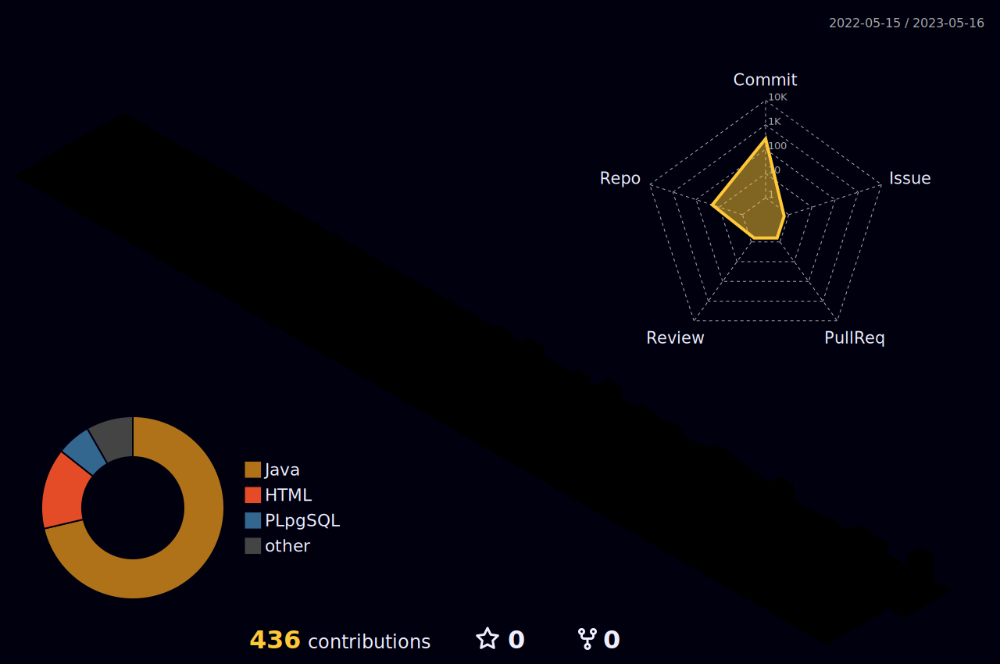

 

- Hi 👋, I'm Feyza. A passionate Software Test Engineer from Turkey 👩🏼‍💻
- 🔭 I’m currently working on **School Management Project**
- 🌱 I’m currently learning **Appium and Cypress**

 
<h3 align="left">Connect with me:</h3>

 

<h3 align="left">Languages and Tools:</h3>

                  

